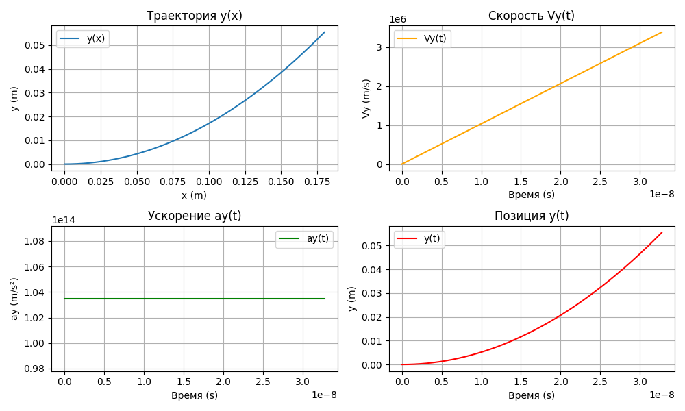

# "Частица в конденсаторе"

## Описание задачи

В данной работе исследуется движение электрона в цилиндрическом конденсаторе. Электрон влетает в конденсатор с начальной скоростью $$V_0$$​, двигаясь параллельно его образующим. Основная цель — определить минимальную разность потенциалов $$U_{min}$$, при которой электрон не покинет конденсатор, а также рассчитать время его полета t и конечную скорость $$V_{кон}$$.

## Формулы
Электрическое поле внутри конденсатора:

$$E = \frac{U}{Rln⁡(R/r)}$$

где R — внешний радиус, r — внутренний радиус, U — разность потенциалов.

Сила, действующая на электрон:

$$F = e⋅E$$

где $$e=1.6⋅10^{−19 } Кл$$

Ускорение электрона:

$$a= \frac{F}{m}=\frac{e⋅E}{m}$$

где $$m=9.1⋅10^{−31}кг.$$

Положение и скорость электрона:
    
$$y(t)=\frac{1}{2}a⋅t^2$$
$$v_y(t)=a⋅t$$

Расчеты выполнены с использованием метода итераций для поиска минимального $$U_{min}$$​, при котором электрон не достигнет краев обкладок.

## Входные данные

## Реализация

Программы для расчета максимальных гироскопических давлений и построения графика:

[Код вычислений](main.py)

[Код для построения графика траектории электрона в пространстве](graph.py)

## Итоговые данные

Минимальная разность потенциалов $$U_{min}$$​: 47.00 В
Время полета $$t$$ : $$3.27×^{10−8} с
Конечная скорость VконVкон​: 6.46×106 м/с6.46×106м/с

Примерный вид графика траектории электрона в пространстве:

    Для предотвращения выхода электрона за пределы конденсатора минимальная разность потенциалов должна составлять Umin=47.00 ВUmin​=47.00В.
    Электрон проходит через конденсатор за t=32.7 нсt=32.7нс, достигая конечной скорости Vкон=6.46 Мм/сVкон​=6.46Мм/с.
    Постоянное ускорение электрона обусловлено однородностью электрического поля внутри конденсатора.
